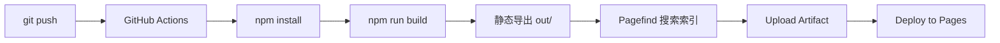

<p align="center">
  
</p>

<h1 align="center">三水博客</h1>

<p align="center">
  暗色玻璃态 · 极光渐变 · 粒子动效 · 全静态个人博客
</p>

<p align="center">
  <a href="https://nextjs.org"></a>
  <a href="https://www.typescriptlang.org"></a>
  <a href="https://tailwindcss.com"></a>
  <a href="https://www.framer.com/motion"></a>
  <a href="https://github.com/SanshuiBot/sanshui-blog/actions"></a>
  <a href="https://sanshuibot.github.io/sanshui-blog"></a>
</p>

---

## 目录

- [设计理念](#-设计理念)
- [技术栈](#-技术栈)
- [项目结构](#-项目结构)
- [快速开始](#-快速开始)
- [添加文章](#-添加文章)
- [部署](#-部署)
- [开发注意事项](#-开发注意事项)

---

## ✨ 设计理念

**Aurora 暗色主题** — 全暗色玻璃态设计系统，极光渐变与物理动效深度融合。

| | |
|---|---|
| 🎨 **暗色玻璃态** | `backdrop-filter: blur(20px)` 半透明卡片，微光边框 |
| 🌈 **极光渐变文字** | 多色渐变 + `background-clip: text` 动画 |
| ⚛️ **Canvas 粒子网络** | Three.js 60 节点粒子系统，动态连线 |
| 🖱️ **自定义鼠标光晕** | CSS `radial-gradient` 延迟跟随的光晕 + 小圆点 |
| 📐 **渐隐网格背景** | `radial-gradient` mask 从中心向四周淡出 |
| 💫 **中心极光光晕** | 三层极光色径向渐变叠加动画 |
| 🃏 **3D 倾斜卡片** | `useMotionValue` + spring 物理模拟鼠标视差 |
| 🔍 **⌘K 全局搜索** | Pagefind 驱动 + 模糊匹配快捷键 |
| 📜 **阅读进度条** | 滚动驱动的渐变进度指示器 |
| 🧭 **自动目录** | 文章 h2/h3 自动提取 + 滚动高亮锚点 |

---

## 🔧 技术栈

| 类别 | 技术 |
|------|------|
| **框架** | Next.js 15 (App Router, SSG 静态导出) |
| **语言** | TypeScript 5 (strict 模式 + 额外严格检查) |
| **样式** | Tailwind CSS v4 (`@theme` 自定义设计令牌，无 tailwind.config.js) |
| **动画** | Framer Motion 12 (spring 物理、滚动驱动、3D 倾斜) |
| **3D** | Three.js + `@react-three/fiber` + `@react-three/drei` |
| **图标** | Lucide React + React Icons |
| **内容** | MDX (`next-mdx-remote/rsc` + remark-gfm + rehype-highlight) |
| **搜索** | Pagefind (静态全文搜索，构建时自动索引) |
| **部署** | GitHub Pages + GitHub Actions 自动 CI/CD |

---

## 🧱 项目结构

```
sanshui-blog/
├── content/posts/              # Markdown 文章 (gray-matter frontmatter)
│   ├── 深入理解-react-19-并发渲染机制.md
│   ├── 金融量化交易系统设计.md
│   └── ...
├── src/
│   ├── app/                    # Next.js App Router 页面
│   │   ├── page.tsx            # 首页 (Hero + Stats + Featured + PostList)
│   │   ├── layout.tsx          # 根布局 (Provider 包裹)
│   │   ├── globals.css         # Tailwind v4 + 自定义设计系统
│   │   ├── fonts.ts            # Inter + JetBrains Mono 字体配置
│   │   ├── not-found.tsx       # 404 页面 (粒子动画)
│   │   ├── loading.tsx         # 全局骨架屏
│   │   ├── about/              # 关于页 (技能条 + 技术栈)
│   │   ├── archive/            # 归档 (按年份分组)
│   │   ├── tags/               # 标签云 + 按标签筛选
│   │   ├── posts/[slug]/       # 文章详情 (RSC MDX 渲染)
│   │   └── links/              # 友链
│   ├── components/
│   │   ├── Layout/             # Navbar · Footer · ScrollProgress
│   │   ├── Home/               # HeroScene · StatsGrid · FeaturedPost
│   │   ├── Post/               # PostCard · PostContent · PostMeta · TOC
│   │   └── UI/                 # CursorGlow · SearchModal · ThemeToggle
│   └── lib/
│       ├── types.ts            # Post 类型定义
│       ├── posts.ts            # 文章读取 (FS 缓存 + 签名)
│       └── toc.ts              # Markdown 标题提取
├── scripts/
│   └── predev.js               # ConsoleNinja 兼容脚本
├── .github/workflows/deploy.yml # GitHub Actions 自动部署
└── public/                     # 静态资源
```

---

## 🚀 快速开始

```bash
# 安装依赖
npm install

# 启动开发服务器 (HMR 热更新)
npm run dev
# → http://localhost:3000

# 生产构建 (静态导出 + Pagefind 搜索索引)
npm run build

# 预览构建产物
npx serve out
```

### 可用命令

| 命令 | 作用 |
|------|------|
| `npm run dev` | 开发模式，`predev` 自动生成路由清单兼容文件 |
| `npm run build` | 静态导出 + Pagefind 索引，需设置 `NEXT_BUILD=1` |
| `npm run start` | Next.js 生产服务器 (非静态导出) |
| `npm run lint` | ESLint 检查 (flat config) |
| `npm run format` | Prettier 格式化 |

---

## 📝 添加文章

在 `content/posts/` 下新建 `.md` 文件即可。文件名中的中文会自动作为 slug。

```markdown
---
title: 文章标题
date: 2026-01-01
tags: [前端, TypeScript]
excerpt: 一句话摘要（可选，不写则自动取正文前 160 字）
---

## 章节标题（自动生成目录锚点）

正文内容…

支持 GFM 表格、代码高亮、自动标题锚点。
```

**Frontmatter 字段：**

| 字段 | 类型 | 说明 |
|------|------|------|
| `title` | string | 必填，文章标题 |
| `date` | string | 必填，YYYY-MM-DD 格式 |
| `tags` | string[] | 可选，标签列表 |
| `excerpt` | string | 可选，摘要，不写则自动截取 |

---

## 📦 部署

每次推送到 `main` 分支，GitHub Actions 自动执行：



**部署特征：**
- 纯静态 HTML 输出（`output: 'export'`），无需 Node.js 服务器
- Pagefind 在构建后自动索引全文搜索
- 安全响应头全开（HSTS、X-Frame-Options、Permissions-Policy）
- 静态资源一年长缓存（immutable）

---

## ⚠️ 开发注意事项

- **纯暗色系统**：项目没有亮色模式，所有颜色基于暗色背景设计
- **Tailwind v4 语法**：使用 `@import "tailwindcss"` / `@plugin` / `@theme`，而非 v3 的 `@tailwind` 指令
- **TypeScript 严格**：`noUncheckedIndexedAccess` 启用，数组/对象索引访问需做 undefined 检查
- **中文 Slug**：路径参数中的中文 slug 在查询时需 `decodeURIComponent`
- **导航状态**：通过 `useNavigationLoading` hook 管理页面过渡动画

---

<p align="center">
  <sub>Built with ♥ by <a href="https://github.com/SanshuiBot">三水</a> · <a href="https://sanshuibot.github.io/sanshui-blog">Live Site</a></sub>
</p>
