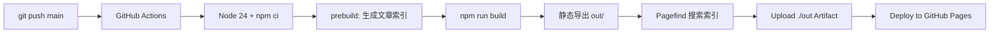

<p align="center">
  
</p>

<h1 align="center">三水博客</h1>

<p align="center">
  暗色玻璃态 · 极光渐变 · 物理动效 · 全静态个人博客
</p>

<p align="center">
  <a href="https://nextjs.org"></a>
  <a href="https://www.typescriptlang.org"></a>
  <a href="https://tailwindcss.com"></a>
  <a href="https://www.framer.com/motion"></a>
  <a href="https://github.com/SanshuiBot/sanshui-blog/actions"></a>
  <a href="https://sanshuibot.github.io/sanshui-blog"></a>
</p>

---

## 目录

- [设计理念](#-设计理念)
- [技术栈](#-技术栈)
- [项目结构](#-项目结构)
- [快速开始](#-快速开始)
- [添加文章](#-添加文章)
- [📄 个人简历模块](#-个人简历模块)
- [🎨 Accent 主题强调色系统](#-accent-主题强调色系统)
- [部署](#-部署)
- [开发注意事项](#-开发注意事项)

---

## ✨ 设计理念

**Aurora 暗色主题** — 全暗色玻璃态设计系统，极光渐变与物理动效深度融合。

|                          |                                                       |
| ------------------------ | ----------------------------------------------------- |
| 🎨 **暗色玻璃态**        | `backdrop-filter: blur(20px)` 半透明卡片，微光边框    |
| 🌈 **极光渐变文字**      | 多色渐变 + `background-clip: text` 动画               |
| 🖱️ **自定义鼠标光晕**    | CSS `radial-gradient` 延迟跟随的光晕 + 小圆点         |
| 📐 **渐隐网格背景**      | `radial-gradient` mask 从中心向四周淡出               |
| 💫 **中心极光光晕**      | 三层极光色径向渐变叠加动画                            |
| 🃏 **3D 倾斜卡片**       | `useMotionValue` + spring 物理模拟鼠标视差            |
| 🔍 **⌘K 全局搜索**       | Pagefind 驱动 + 运行时 fetch 轻量索引                 |
| 📜 **阅读进度条**        | 滚动驱动的渐变进度指示器                              |
| 🧭 **自动目录**          | 文章 h2/h3 自动提取 + 滚动高亮锚点                    |
| 🎯 **三水极光 favicon**  | 三条流动水波 + 极光渐变，呼应「三水」之名             |
| 📜 **流式打印简历**      | 终端式逐行打印 `content/resume.md`，暗/亮双主题适配   |
| 🎨 **Accent 主题强调色** | 5 个预设调色板 + 6 通道自定义色板，运行时换色全站联动 |

---

## 🔧 技术栈

| 类别     | 技术                                                             |
| -------- | ---------------------------------------------------------------- |
| **框架** | Next.js 15.5 (App Router, SSG 静态导出)                          |
| **语言** | TypeScript 5 (strict 模式 + `noUncheckedIndexedAccess`)          |
| **样式** | Tailwind CSS v4 (`@theme` 自定义设计令牌，无 tailwind.config.js) |
| **动画** | Framer Motion 12 (spring 物理、滚动驱动、3D 倾斜)                |
| **图标** | Lucide React + 自定义 SVG 图标（无 react-icons 整包依赖）        |
| **内容** | MDX (`next-mdx-remote/rsc` + remark-gfm + rehype-highlight)      |
| **搜索** | Pagefind (静态全文搜索，构建时自动索引)                          |
| **部署** | GitHub Pages + GitHub Actions 自动 CI/CD                         |

---

## 🧱 项目结构

```
sanshui-blog/
├── content/
│   ├── posts/                  # Markdown 文章 (gray-matter frontmatter)
│   │   ├── 深入理解-react-19-并发渲染机制.md
│   │   ├── 金融量化交易系统设计.md
│   │   └── ...
│   └── resume.md               # 个人简历源文件（流式打印模块读取）
├── src/
│   ├── app/                    # Next.js App Router 页面
│   │   ├── page.tsx            # 首页 (Hero + Stats + Featured + PostList)
│   │   ├── layout.tsx          # 根布局 (Provider 包裹，favicon metadata)
│   │   ├── globals.css         # Tailwind v4 + 自定义设计系统 + 简历模块双主题
│   │   ├── fonts.ts            # Inter + JetBrains Mono 字体配置
│   │   ├── not-found.tsx       # 404 页面 (粒子动画)
│   │   ├── loading.tsx         # 全局骨架屏
│   │   ├── about/              # 关于页 (技能条 + 技术栈 + 流式简历)
│   │   ├── archive/            # 归档 (按年份分组)
│   │   ├── tags/               # 标签云 + 按标签筛选
│   │   ├── posts/[slug]/       # 文章详情 (RSC MDX 渲染)
│   │   └── links/              # 友链
│   ├── components/
│   │   ├── Layout/             # Navbar · Footer · ScrollProgress
│   │   ├── Home/               # HeroScene · StatsGrid · FeaturedPost
│   │   ├── Post/               # PostCard · PostContent · PostMeta · TOC
│   │   ├── About/              # ResumeTerminal (流式打印简历)
│   │   └── UI/                 # CursorGlow · GithubIcon · SearchModal · ThemeToggle · NavigationLoading
│   └── lib/
│       ├── types.ts            # Post 类型定义（server-only）
│       ├── posts.ts            # 文章读取 (mtime 签名缓存 + decodeURIComponent)
│       ├── toc.ts              # Markdown h2/h3 提取（保留中文锚点）
│       ├── resume.ts           # 简历读取 (构建期 fs.readFileSync)
│       └── basePath.ts         # 构建时 basePath 中心定义
├── scripts/
│   ├── predev.js               # ConsoleNinja 兼容脚本
│   └── gen-posts-index.js      # 生成轻量文章索引 (SearchModal 运行时 fetch)
├── .github/workflows/deploy.yml # GitHub Actions 自动部署
└── public/                     # 静态资源 (favicon.svg/ico · posts-index.json · _headers)
```

---

## 🚀 快速开始

```bash
# 安装依赖
npm install

# 启动开发服务器 (HMR 热更新)
npm run dev
# → http://localhost:3000

# 生产构建 (静态导出 + Pagefind 搜索索引)
npm run build

# 预览构建产物
npx serve out
```

### 可用命令

| 命令                   | 作用                                                                               |
| ---------------------- | ---------------------------------------------------------------------------------- |
| `npm run dev`          | 开发模式，`predev` 自动生成 ConsoleNinja 兼容的路由清单 + 文章索引                 |
| `npm run build`        | 静态导出 + Pagefind 索引，通过 `NEXT_BUILD=1` 环境变量开启                         |
| `npm run start`        | Next.js 生产服务器（本项目为纯静态导出，通常不用，静态托管在任意 HTTP 服务器即可） |
| `npm run lint`         | ESLint v9 flat config，只报告不修改                                                |
| `npm run lint:fix`     | 运行 ESLint 并自动修复可修复的问题                                                 |
| `npm run format`       | 用 Prettier 原地格式化全项目文件                                                   |
| `npm run format:check` | 用 Prettier 只检查不修改（CI 中常用）                                              |
| `npx tsc --noEmit`     | 类型检查（构建脚本带 `--no-lint`，CI/本地须单独跑 lint + tsc）                     |
| `npx serve out`        | 本地起 HTTP 服务器预览 `out/` 静态产物                                             |

### 构建脚本流程

```
npm run dev
  └─ predev → 生成 .next/routes-manifest.json (ConsoleNinja 兼容)
  └─ next dev (HMR，无 basePath/assetPrefix)

npm run build
  └─ prebuild → 生成 public/posts-index.json (~3KB)
  └─ cross-env NEXT_BUILD=1 next build --no-lint → 静态导出 out/
  └─ pagefind --site out → 全文搜索索引
```

---

## 📝 添加文章

在 `content/posts/` 下新建 `.md`（或 `.mdx`）文件即可。文件名即 slug，建议中文+连字符命名以保持 URL 可读性（如 `深入理解-react-19-并发渲染机制.md`）。TOC 自动从 `##` / `###` 提取，rehype-highlight 自动代码高亮，`CodeCopyInjector` 在客户端给代码块注入复制按钮。

```markdown
---
title: 文章标题
date: 2026-01-01
tags: [前端, TypeScript]
excerpt: 一句话摘要（可选，不写则自动取正文前 160 字；含代码块开头的文章建议显式写）
---

## 章节标题（自动生成目录锚点）

正文内容…

支持 GFM 表格、代码高亮、自动标题锚点。
```

**Frontmatter 字段：**

| 字段      | 类型     | 必填 | 说明                      |
| --------- | -------- | ---- | ------------------------- |
| `title`   | string   | ✅   | 文章标题                  |
| `date`    | string   | ✅   | `YYYY-MM-DD`，用于排序    |
| `tags`    | string[] | ❌   | 标签列表，驱动 `/tags` 页 |
| `excerpt` | string   | ❌   | 摘要，不写则自动截取      |

> 💡 新增/修改文章后，`predev` 或 `prebuild` 钩子会自动重新生成 `public/posts-index.json`，SearchModal 即可搜索到新文章。但**线上 HTML 只在重新 `npm run build` 后更新**。

> ⚠️ 文章排版样式走 `globals.css` 里手写的 `.prose-article` 类（h1/h2/h3 字号颜色、`a` 紫粉渐变、`code` 紫底、`blockquote` 紫边等），**未用 Tailwind Typography 的 `prose` 类**。改文章样式就改 `.prose-article` 这段 CSS。

---

## 📄 个人简历模块

关于页（`/about`）内置一个**终端式流式打印简历**模块：进入视口后，简历内容会一行行像终端 `cat` 输出般逐行打印，直至完整呈现。

### 工作原理

```
content/resume.md  ──(构建期 fs.readFileSync)──►  src/lib/resume.ts
                                                          │
                                                          ▼
src/app/about/page.tsx ──(注入 markdown prop)──►  AboutContent
                                                          │
                                                          ▼
                                          src/components/About/ResumeTerminal.tsx
                                          (IntersectionObserver 触发 + setTimeout 逐行打印)
```

- **数据源**：`content/resume.md`（纯 Markdown，约 4KB）
- **读取时机**：构建期同步读取，注入 `AboutContent` 作为 `resumeMarkdown` prop
- **动画触发**：`IntersectionObserver` 监听组件进入视口（threshold 0.2），首次进入即启动打印
- **打印节奏**：`setTimeout` 调度，空行 0.4×、标题行 2.4×、普通行 1×（默认 `lineDelay = 60ms`）
- **自动滚动**：每打印一行自动 `scrollTop = scrollHeight`，模拟终端追加
- **双主题适配**：`globals.css` 中 `.resume-terminal` 用 CSS 变量定义暗/亮两套配色，`html:not(.dark)` 覆盖亮色值

### 渲染能力

| Markdown 语法  | 渲染效果                    |
| -------------- | --------------------------- |
| `# / ## / ###` | 紫色高亮标题，层级决定字号  |
| `- xxx`        | 青色圆点列表项              |
| `> xxx`        | 粉色左边框引用块            |
| `---`          | 灰色分隔线                  |
| `**粗体**`     | 加粗白色文字                |
| `` `代码` ``   | 浅紫底 + 紫色文字的行内代码 |

### 性能特征

- **零运行时 fetch**：简历文本在构建期注入静态 HTML，无 API 路由、无网络请求
- **路由级代码分割**：`ResumeTerminal` 仅被 `/about/` 路由按需加载，首页/文章/标签页 JS bundle 不含此组件
- **动画不阻塞渲染**：`setTimeout` 调度对主线程几乎零负担，`IntersectionObserver` 仅触发一次
- **静态导出场景零运行时开销**：about 页面在 `npm run build` 时已预渲染为静态 HTML

### 修改简历

直接编辑 `content/resume.md` 即可，无需改代码。支持的标准 Markdown 语法见上表。下次 `npm run dev` 或 `npm run build` 自动生效。

---

## 🎨 Accent 主题强调色系统

全站 6 个 accent 色（pink/violet/blue/teal/gold/rose）通过 CSS 变量 `--accent-*-rgb`（空格分隔 RGB 三元组，如 `168 85 247`）驱动。所有阴影、glow、hljs 高亮、prose-article 链接、resume-terminal、Aurora 文字渐变均经由 `rgb(var(--accent-xxx-rgb) / α)` 引用——**改这 6 个变量 = 全站联动**。

### 机制链路

| 层      | 文件                                 | 职责                                                                                                |
| ------- | ------------------------------------ | --------------------------------------------------------------------------------------------------- |
| 数据    | `src/lib/accents.ts`                 | 5 个预设（极光/翡翠/落日/深海/樱影）+ 自定义预设 + `applyAccent()`/`hexToRgb()`/`getCustomPreset()` |
| UI      | `src/components/UI/AccentPicker.tsx` | Navbar 上的 🎨 图标，Popover 上半列 5 个预设，下半「自定义」区 6 个 `<input type="color">`          |
| 防 FOUC | `src/app/layout.tsx`                 | `<head>` 内联 `accentBootstrap` script，首屏前同步读 `aurora-accent`，写 6 个 `--accent-*-rgb`      |

### 持久化

- `aurora-accent`：存当前激活预设 id（`aurora`/`emerald`/`sunset`/`ocean`/`sakura`/`custom`）
- `aurora-accent-custom`：存自定义预设 JSON（6 个通道的 RGB 三元组）

### 新增需要 accent 色的代码

| 场景                         | 做法                                                                                                                                      |
| ---------------------------- | ----------------------------------------------------------------------------------------------------------------------------------------- |
| 新增 CSS 用 accent 色        | `rgb(var(--accent-xxx-rgb) / α)`，**不要**写死 `rgba(168, 85, 247, ...)` 或 `#a855f7`                                                     |
| 新增 hover 变色              | **用纯 CSS**（自定义类 + `:hover`），**不要走 Framer Motion** `whileHover`（详见开发注意事项）                                            |
| 新增需要联动 accent 的 hover | **不要用 Tailwind utility**（`group-hover/link:text-accent-violet`），改用自定义 CSS 类，`html.dark` / `html:not(.dark)` 双前缀提升特异性 |
| 新增预设                     | 在 `ACCENT_PRESETS`（`src/lib/accents.ts`）追加一项，inline script 已内联全部预设无需改 layout                                            |
| 改默认预设                   | 改 `DEFAULT_ACCENT_ID`，inline script 的 `def` 也会跟着走                                                                                 |

> ⚠️ inline script 里 `presets` JSON 是构建期固化的，**新增预设后必须重新 `npm run build`** 才能被防 FOUC script 识别。

---

## 📦 部署

每次推送到 `main` 分支，GitHub Actions 自动执行：


```mermaid
graph LR
  A["git push main"] --> B["GitHub Actions"]
  B --> C["Node 24 + npm ci"]
  C --> D["prebuild: 生成文章索引"]
  D --> E["npm run build"]
  E --> F["静态导出 out/"]
  F --> G["Pagefind 搜索索引"]
  G --> H["Upload ./out Artifact"]
  H --> I["Deploy to GitHub Pages"]
```

CI 配置见 `.github/workflows/deploy.yml`：Node 24、`npm ci` 严格安装、`npm run build` 静态导出、`actions/upload-pages-artifact@v3` 上传 `./out`、`actions/deploy-pages@v4` 部署。`concurrency.group: "pages"` + `cancel-in-progress: false` 保证部署串行不中断。

**部署特征：**

- 纯静态 HTML 输出（`output: 'export'`），无需 Node.js 服务器
- Pagefind 在构建后自动索引全文搜索
- 安全响应头走 `public/_headers`（`X-Content-Type-Options: nosniff`、`X-Frame-Options: DENY`、`Referrer-Policy`、`Permissions-Policy`）；`output: 'export'` 下 `next.config.ts` 的 `headers()` 不生效
- 静态资源一年长缓存（`/_next/static/*` 与 `/pagefind/*`，`immutable`）

---

## ⚠️ 开发注意事项

- **亮色为主、暗色可选**：默认 **亮色主题**。`next-themes`（`attribute="class"`、`defaultTheme="system"`、`enableSystem`、`storageKey="aurora-theme"`）——未手动切换时跟随系统偏好。CSS 默认状态下 `<html>` 无 `.dark` 类，`globals.css` 用大量 `html:not(.dark) ...` 选择器把 body 渲染成亮色（背景 `#fafaf9`、文字 `#1c1917`、玻璃半透明白、shadow 偏淡）。暗色令牌定义在 `@theme` 与 `:root`（`--color-ink` 等），暗色模式下通过 `.dark` 类激活。`ThemeToggle` 调 `setTheme(isDark?'light':'dark')`。`layout.tsx` 的 `viewport` 同步声明亮色值（`colorScheme: 'light'`、`themeColor: '#fafaf9'`），保证浏览器 UA（滚动条/表单控件/地址栏）与默认主题一致。**改暗色变量时同步检查 `html:not(.dark)` 亮色分支**，否则亮色会错乱
- **Tailwind v4 语法**：使用 `@import "tailwindcss"` / `@plugin` / `@theme`，而非 v3 的 `@tailwind` 指令；PostCSS 插件是 `@tailwindcss/postcss`
- **TypeScript 严格**：`strict: true` + `noUncheckedIndexedAccess` + `noUnusedLocals` + `noUnusedParameters`，所有索引访问都需 undefined 检查
- **中文 Slug**：`getPostBySlug()` 内部做了 `decodeURIComponent(slug)`，但 `generateStaticParams` 返回原始 slug，新增 slug 查询时必须一致地对中文做 decodeURIComponent
- **导航状态**：通过 `useNavigationLoading` hook（来自 `@/components/UI/NavigationLoading`）管理页面过渡状态，所有 `<Link>` 应调用 `startNavigation` 触发加载指示器
- **自定义 Easing 曲线**：Tailwind 主题预定义了 `--ease-out-expo`、`--ease-out-back`、`--ease-in-out-circ`，Framer Motion 动画大量使用 `[0.16, 1, 0.3, 1]` 等自定义曲线
- **静态导出通过环境变量切换**：`next.config.ts` 中 `output: 'export'`、`basePath`、`assetPrefix` **仅**在 `NEXT_BUILD=1` 时生效。`npm run dev` 不会设置此变量，因此开发模式下没有 `basePath`、没有 `assetPrefix`。**不要手动设置 `output: 'export'`**，否则 HMR 会挂
- **basePath 双边一致**：`process.env.NEXT_BUILD` 没有 `NEXT_PUBLIC_` 前缀，Next.js 不会把它 inline 到客户端 bundle。`next.config.ts` 通过 `env: { NEXT_PUBLIC_BASE_PATH: BASE_PATH }` 把 basePath 注入 `NEXT_PUBLIC_BASE_PATH`，Next.js 会 inline 到 SSR + 客户端 bundle 两边，`src/lib/basePath.ts` 读取此变量。新增需要 basePath 的客户端代码时，**必须**走 `withBase()`，不要自己拼 `process.env.NEXT_BUILD`
- **RSC payload 优化**：`getAllPosts()` 已从 `layout.tsx` 移除，文章数据通过 `public/posts-index.json`（~3KB）在 SearchModal 运行时 fetch，避免全量文章数据被序列化进根 layout 的 RSC payload
- **重组件懒加载**：`CursorGlow`、`ScrollProgress`、`ClickEffect` 等非首屏必需的 client 组件通过 `next/dynamic` 懒加载，避免被打进首屏 chunk 图
- **sharp 依赖**：`package.json` 的 `overrides` 锁定 `sharp: "^0.35.3"` 与 `postcss: "^8.5.20"`，保证静态导出 + `images.unoptimized: true` 场景下依赖树稳定
- **`out/` 是构建产物**：`out/` 在 `.gitignore` 中、未被 git 跟踪，是 `npm run build` 的静态导出产物。`out/en/` 等陈旧子树可能是早期英文版 / `[locale]` i18n 路由的构建残留，**源码里已无对应路由**。排查路由时以 `src/app/` 为准，不要把 `out/` 的旧产物当成当前结构，也不要手动清理 `out/`——下次 `build` 会整体覆盖
- **`next.config.ts` 隐式约定**：
  - `images.unoptimized: true`：静态导出无服务端图像优化器，`next/image` 退化为原图直出，新增图片需自行压缩
  - `trailingSlash: true`：所有路由以 `/` 结尾（如 `/posts/xxx/`），`generateStaticParams` 与内部链接拼接都必须遵守，否则线上 404
  - `experimental.optimizePackageImports: ['framer-motion','lucide-react','react-icons']`：让大库按需引入，**不要再自定义 `splitChunks`**——会与 Next 15 SWC 内置 chunk 策略冲突，反而拆出更多碎 chunk
  - `reactStrictMode: true`：开发模式下 effects 会执行两次（mount → unmount → mount），副作用清理逻辑必须幂等
- **安全头走 `public/_headers`**：`output: 'export'` 模式下，`next.config.ts` 的 `headers()` **不会生效**——静态 HTML 由 GitHub Pages 直接返回，不经过 Next。安全响应头（`X-Content-Type-Options: nosniff`、`X-Frame-Options: DENY`、`Referrer-Policy`、`Permissions-Policy`）通过仓库根的 `public/_headers` 配置，Next 静态导出会原样复制到 `out/_headers`，GitHub Pages 会识别。新增响应头改 `public/_headers`，不要改 `next.config.ts`
- **TOC 只提取 h2/h3，标题锚点保留中文**：`src/lib/toc.ts` 的 `extractHeadings()` 只匹配 `^#{2,3}\s+`（即 `##` 和 `###`），`#`（h1）和 `####`（h4）不会进目录。生成的 `id` 用正则 `[\w\u4e00-\u9fff\s-]` 过滤，**保留中文字符**，所以中文标题会得到中文锚点（如 `## 章节标题` → `id="章节标题"`）。rehype-slug 在 MDX 渲染侧也会生成 id，两边规则需保持一致。新增需要进目录的标题，必须用 `##` 或 `###`
- **`posts.ts` 读取层契约**：
  - `'server-only'` 标记：`posts.ts` / `toc.ts` / `types.ts` 顶部都有 `import 'server-only'`，这些 lib **只能在 RSC / Server Component 里调用**，不能 import 进 client 组件。客户端需要文章数据时 fetch `public/posts-index.json`
  - mtime 签名缓存：`getAllPosts()` 用 `computeSignature()`（文件名 + `mtimeMs` 拼接）做缓存键，文件未改动时直接返回内存缓存。**不要在运行时修改 `content/posts/` 下的文件**——签名会变但 SSG 已固化，只能通过重新 `build` 生效
  - excerpt 兜底：未写 `excerpt` 时取正文前 160 字并 `replace(/[#*`\[\]]/g,'')`去掉 markdown 符号，注意这个正则会**误删反引号围栏代码块的内容**，含代码开头的文章建议显式写`excerpt`
- **hover 变色不要走 Framer Motion**：`whileHover={{ color: 'rgb(var(--accent-violet-rgb))' }}` 会把动画后的 `color` 写成 **inline style**，CSS 变量在 inline style 中被解析成具体值（如 `rgb(168 85 247)`）后就**不再响应** `--accent-*-rgb` 的变化——切 Accent 主题色、切亮/暗模式时，标题会卡在动画那一刻的颜色上，看起来像「变白/变黑不响应主题」。**正确做法**：hover 变色用纯 CSS（自定义类 + `:hover`），颜色完全交给 CSS 变量系统；位移动画也一并迁到 CSS `transform`。PostCard 标题（`.post-card-title`）、「阅读」箭头（`.post-card-readmore` + `.post-card-link:hover`）就是这么改的
- **Tailwind v4 utility 的 layer 优先级坑**：Tailwind v4 把 utility 类（`text-gray-500`、`group-hover/link:text-accent-violet` 等）注入到 `@layer utilities` 里。而 `globals.css` 中那些 `html:not(.dark) .text-gray-500 { color: #78716c }` 亮色覆盖规则是**裸 CSS**（不在任何 `@layer` 内）。**裸 CSS 优先级高于任何 `@layer` 内的同特异性规则**，所以亮色模式下 `group-hover/link:text-accent-violet` 这类 utility hover 会被裸覆盖规则持续压制，hover 不变色。**正确做法**：需要响应 Accent 主题色联动的 hover 变色，**不要用 Tailwind utility**，改用自定义 CSS 类，`html.dark` / `html:not(.dark)` 双前缀提升特异性到 (0,3,1)，稳压裸覆盖规则

---

## 📄 License

MIT © 三水

---

<p align="center">
  <sub>Built with ♥ by <a href="https://github.com/SanshuiBot">三水</a> · <a href="https://sanshuibot.github.io/sanshui-blog">Live Site</a></sub>
</p>
